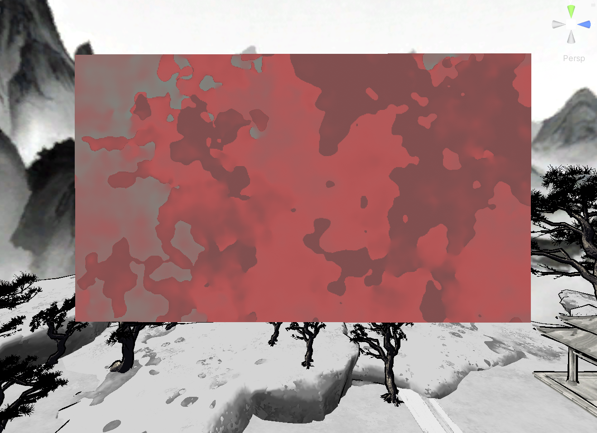
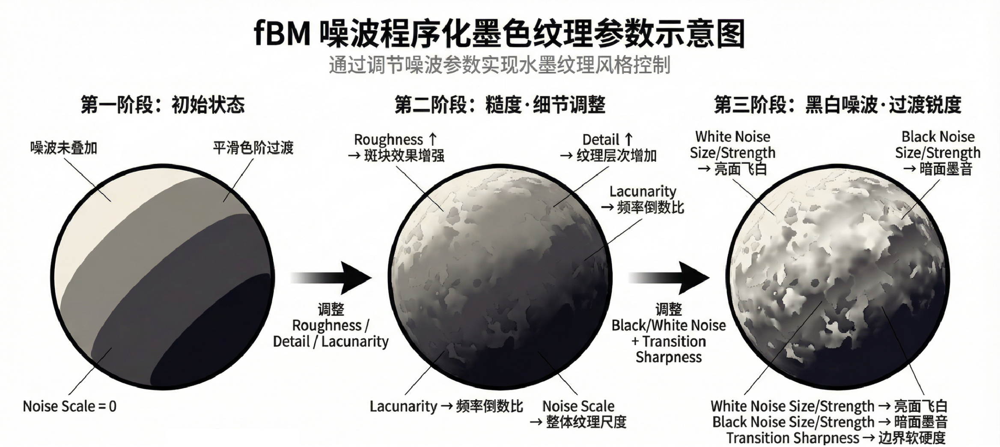

# Ink Texture fBM Shader (Unity)

一个用于 **Unity Built-in Render Pipeline** 的水墨风格 Shader。  仿 **Blender 的 3D fBM 噪波算法** 并结合屏幕空间边缘检测，实现unity程序化水墨材质。

* 关于blender内水墨纹理的实现参考了五天晴老师的方案。

## Features

- **Blender fBM Noise**  
  使用 Blender 的 3D fBM 噪波算法替代简单伪随机噪波，结构更稳定、分布更自然。

- **墨色分层（Ink Ramp）**  
  通过 `smoothstep` 将连续噪波离散化，形成类似水墨画“墨分层次”的效果。

- **水渍边缘模拟**  
  使用 `ddx / ddy` 计算噪波梯度，在边界处自动加深墨色，模拟宣纸扩散后的水渍边缘。

- **Object Space 采样**  
  材质在模型移动或变形时保持稳定，不产生纹理滑动。

---
将 Shader 应用到材质后即可在模型上生成程序化水墨纹理。

## Preview

